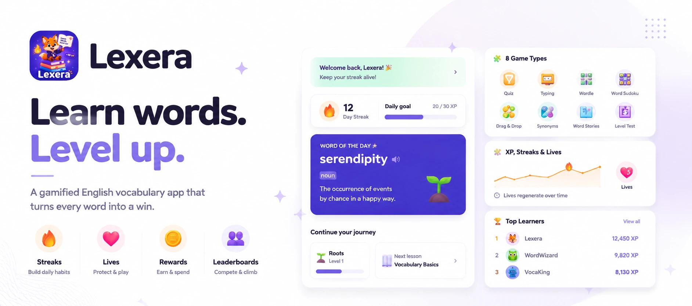
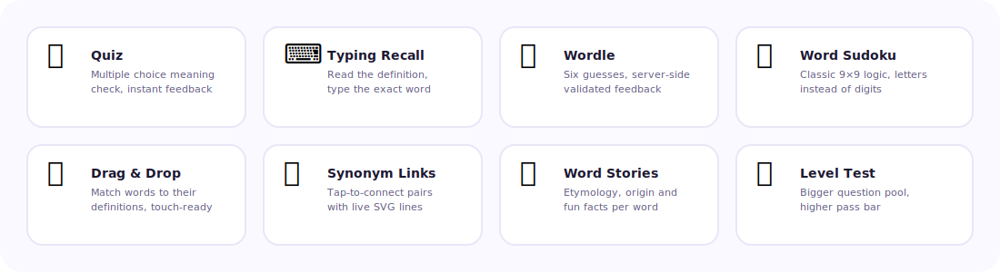
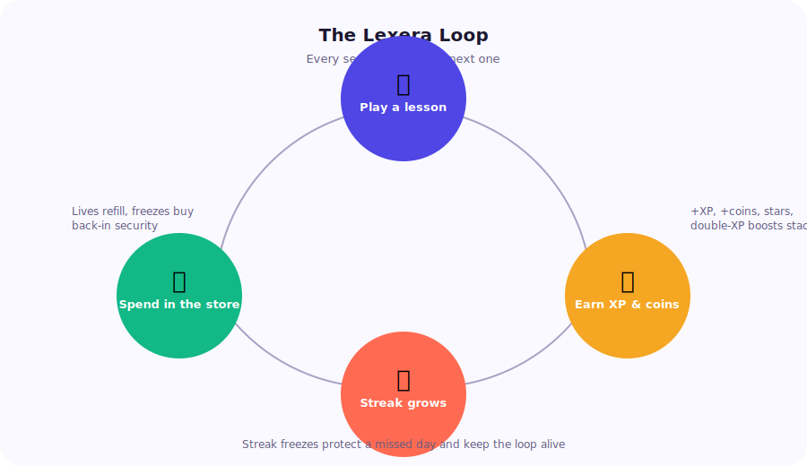
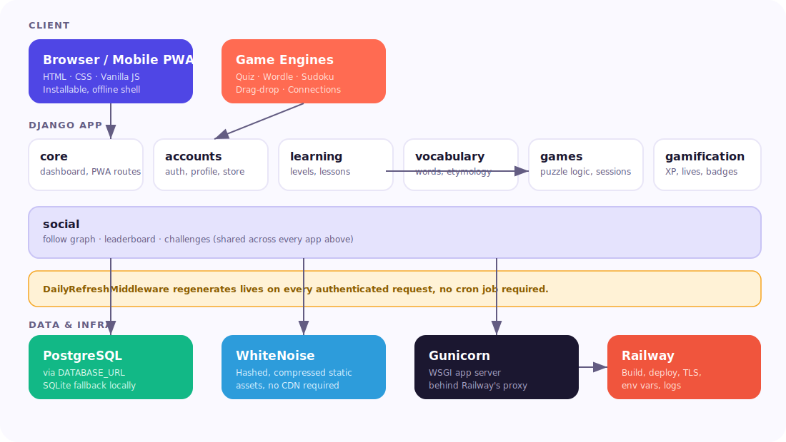

<div align="center">



<br>
<br>

[](https://www.djangoproject.com/)
[](https://www.python.org/)
[](#-installable-as-a-real-app)
[](#-deploying-to-railway)
[](#-license)

**A gamified English vocabulary app that makes learning words feel like a game worth returning to.**

Built with Django, vanilla JavaScript and a fully custom design system. No template look-alikes, no filler.

</div>

<br>

## Table of contents

- [Why Lexera](#why-lexera)
- [Feature overview](#feature-overview)
- [The eight game types](#the-eight-game-types)
- [The Lexera loop](#the-lexera-loop)
- [System architecture](#system-architecture)
- [Project layout](#project-layout)
- [Getting started locally](#getting-started-locally)
- [Deploying to Railway](#deploying-to-railway)
- [Brand system](#brand-system)
- [Roadmap to a public launch](#roadmap-to-a-public-launch)
- [License](#license)

<br>

## Why Lexera

Most vocabulary apps are either a flashcard deck with a coat of paint, or a bloated platform
that buries learning under menus. Lexera picks a narrower, sharper goal: turn a real English
dictionary into a daily habit, using the mechanics that already work in the best consumer
products on the market today.

Every word in the system carries more than a definition. It ships with pronunciation, part
of speech, an example sentence, its origin language, first known use and a short story about
where it came from. Language has history, and Lexera treats that history as content, not
trivia.

<br>

## Feature overview

<table>
<tr>
<td width="33%" valign="top">

### 🎯 Learning core
- 5 difficulty levels, Roots through Summit
- 40 seeded lessons, 60+ curated words
- Full etymology on every word
- Searchable in-app dictionary

</td>
<td width="33%" valign="top">

### 🔥 Gamification
- XP curve with rising thresholds
- Daily streaks with freeze protection
- Lives that regenerate over time
- Coin economy and a real store

</td>
<td width="33%" valign="top">

### 👥 Social
- Follow and be followed
- Friends and global leaderboards
- Birthday balloons on profiles
- Challenge model ready to extend

</td>
</tr>
</table>

<br>

## The eight game types

Lexera does not reuse one quiz format with a different skin. Each lesson type is a distinct
mechanic, built to test recall in a different way.



| Type | What it tests | Server-validated |
|---|---|:---:|
| Quiz | Recognising a definition | Client-scored |
| Typing recall | Producing the word from memory | Client-scored |
| Wordle | Letter-level deduction | ✅ |
| Word Sudoku | Logic under a vocabulary constraint | ✅ |
| Drag and drop | Matching words to meaning | Client-scored |
| Synonym links | Relating words to each other | Client-scored |
| Word stories | Reading retention | Completion only |
| Level test | Everything at once, higher bar | Client-scored |

<br>

## The Lexera loop

Retention products live or die on their core loop. Lexera's is short on purpose: finish a
lesson, get rewarded immediately, watch the streak grow, and have somewhere meaningful to
spend what you earned.



A streak freeze, bought with coins, quietly protects a missed day so one bad Tuesday does not
erase a month of consistency. That single mechanic is responsible for a meaningful share of
long-term retention in every major habit app, and Lexera ships it from day one.

<br>

## System architecture



The app is organised into six focused Django apps rather than one monolithic app. Each one
owns a single responsibility, which keeps the models small and the admin panel readable.

| App | Owns |
|---|---|
| `core` | Landing page, dashboard, PWA routes (manifest, service worker, offline page) |
| `accounts` | Custom `User` model, auth, profile, store, life and streak logic |
| `vocabulary` | `Word` and `WordOfDay` models, the `seed_lexera` content command |
| `learning` | `Level`, `Lesson`, `LessonProgress`, the path shown on the dashboard |
| `games` | Gameplay views and puzzle generation (`games/logic.py`) |
| `gamification` | Boosts, badges, XP events, the passive life-regen middleware |
| `social` | Follow graph and the challenge model |

<br>

## Project layout

```text
config/          settings, root urls, wsgi entrypoint
core/            landing page, dashboard, PWA routes
accounts/        custom User model, auth, profile, follow, leaderboard, store
learning/        Level, Lesson, LessonProgress models
vocabulary/      Word, WordOfDay models, seed_lexera management command
games/           gameplay views and puzzle-generation logic
social/          Follow, Challenge models
gamification/    Boost, Badge, XPEvent, StoreItem, life-regen middleware
static/css/      lexera.css, the entire design system in one file
static/js/       app.js, shared confetti, balloons and API helpers
templates/       one folder per app, matching the structure above
docs/assets/     the diagrams used in this README
```

<br>

## Getting started locally

```bash
python3 -m venv venv
source venv/bin/activate        # venv\Scripts\activate on Windows
pip install -r requirements.txt

export DEBUG=True               # local dev only
python manage.py migrate
python manage.py seed_lexera    # loads words, levels, lessons, store items, badges
python manage.py createsuperuser

python manage.py runserver
```

Open `http://127.0.0.1:8000/`. Sign up from the landing page, or manage content directly at
`/admin/` with the superuser you just created.

<br>

## Deploying to Railway

This repository is Railway-ready out of the box. `Procfile`, `railway.json` and `runtime.txt`
are already in place, static files are served by WhiteNoise, and the database layer speaks
Postgres the moment `DATABASE_URL` exists in the environment.

1. Push this folder to a GitHub repository.
2. In Railway, choose **New Project → Deploy from GitHub repo** and select it.
3. Add a database: **New → Database → PostgreSQL**. Railway injects `DATABASE_URL` into the
   web service automatically.
4. Set these environment variables on the web service:

   | Variable | Value |
   |---|---|
   | `SECRET_KEY` | a long random string, see `.env.example` for how to generate one |
   | `DEBUG` | `False` |
   | `ALLOWED_HOSTS` | `your-app.up.railway.app` |
   | `CSRF_TRUSTED_ORIGINS` | `https://your-app.up.railway.app` |

5. Deploy. The start command runs migrations, refreshes seed content, collects static files
   and boots gunicorn, in that order, every time.
6. Create your first admin account with `railway run python manage.py createsuperuser`.

Security hardening (secure cookies, HSTS, forced HTTPS redirect) switches on automatically
whenever `DEBUG=False`, and is designed around Railway's HTTPS-terminating proxy through
`SECURE_PROXY_SSL_HEADER`.

<br>

## Installable as a real app

Lexera ships a manifest, a service worker and an offline fallback page. On a phone, "Add to
Home Screen" produces a standalone icon with no browser chrome, a custom splash color, and a
bottom tab bar that behaves like a native app rather than a website squeezed into a viewport.

<br>

## Brand system

<table>
<tr><td width="50%" valign="top">

**Colour**

| Role | Hex |
|---|---|
| Primary (Indigo) | `#4F46E5` |
| Accent (Coral) | `#FF6B52` |
| Success (Mint) | `#12B886` |
| Streak (Amber) | `#F5A623` |
| Ink (text) | `#1B1730` |

</td><td width="50%" valign="top">

**Type and mark**

- Display font: **Baloo 2**, rounded and confident for headings
- Body font: **Outfit**, clean and legible at small sizes
- Logo: an abstract "L" shaped like an open book, with a coral
  notch that doubles as a play marker
- Full token set lives in `static/css/lexera.css`

</td></tr>
</table>

<br>

## Roadmap to a public launch

Lexera runs end to end today: real auth, real gameplay, real persistence, a genuinely
designed interface. Before opening it to the public, plan for the following.

- [ ] Move rate limiting onto the auth and puzzle-session endpoints
- [ ] Move quiz and typing scoring fully server-side to close the client-trust gap
- [ ] Wire the `Challenge` model to a live friend-duel screen
- [ ] Add automated badge-award triggers on streak and level milestones
- [ ] Add a test suite and continuous integration
- [ ] Connect error monitoring, for example Sentry

<br>

## License

MIT. Build on it, fork it, ship it.

<br>

<div align="center">
<sub>Made for people who would rather learn a word than scroll past one.</sub>
</div>
